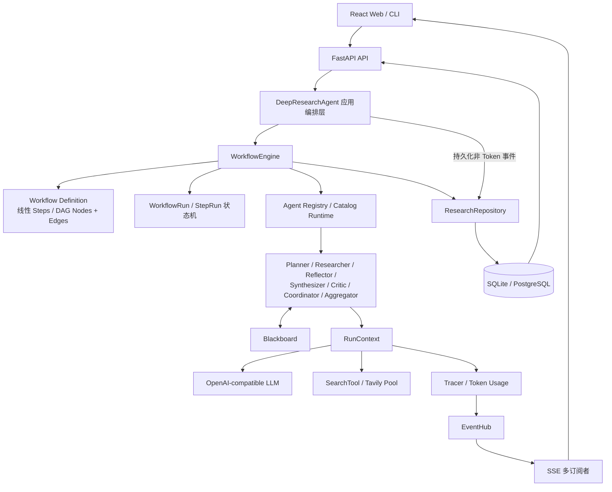
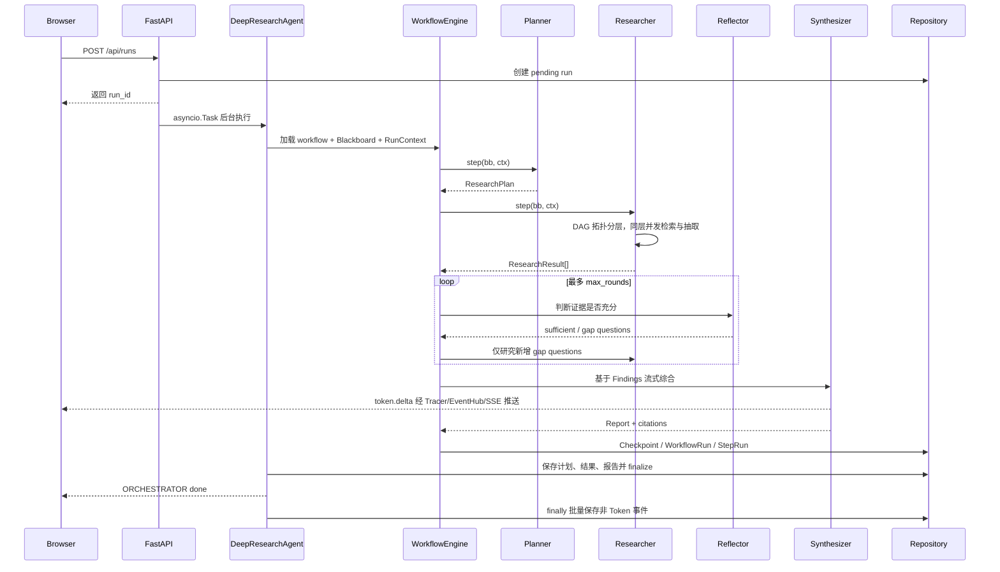

# Deep Research Agent 项目整体分析与 Agent 岗位简历指南

> 本文基于当前仓库实现编写，目标不是重复 README，而是从产品定位、功能思想、架构设计、完整执行链、工程可靠性和岗位匹配度几个角度，形成一份可以用于简历撰写和面试讲解的项目分析。
>
> 代码基线：2026-07-21。文中明确区分“当前已经实现”“可以合理概括”“后续演进方向”，避免把原型能力包装成尚不存在的生产能力。

---

## 1. 项目结论先行

### 1.1 一句话定位

Deep Research Agent 是一个面向长耗时、开放域研究任务的多 Agent 深度研究与工作流编排平台：它把复杂问题拆解为带依赖的子问题，通过 DAG 分层并发检索、结构化证据抽取、有界反思补洞和带引用报告生成完成研究，并提供声明式工作流、角色级模型路由、实时观测、持久化回放和断点恢复能力。

### 1.2 它不是哪一类项目

它不是“给大模型套一层聊天页面”，也不是只有向量检索和单轮生成的普通 RAG Demo。这个项目真正要解决的是：

- 如何把一个开放问题变成可执行、可依赖、可并发的研究任务图；
- 如何让多个 Agent 共享状态但保持职责和控制流解耦；
- 如何约束 LLM 只能基于本轮真实检索来源形成证据；
- 如何让 LLM 参与动态决策，同时不让它获得无限制的执行权；
- 如何管理一个持续几十秒甚至更久的异步任务，包括失败、预算、进度、恢复和历史回放；
- 如何把 Agent 编排能力做成用户可以观察、配置和编辑的完整产品。

### 1.3 最适合 Agent 岗位讲的项目主线

面试时不要平均介绍所有页面和接口，建议围绕以下三条主线展开：

1. **Workflow-as-Data 的多 Agent 编排**：统一 Agent 协议、Blackboard 状态、线性/DAG 工作流、条件边、Join、动态组合和团队并行。
2. **证据约束的研究闭环**：依赖感知检索、结构化抽取、URL 白名单、有界反思和代码维护的引用映射。
3. **长任务的可靠执行**：节点状态机、超时重试与降级、Token 预算、Checkpoint、定义快照、恢复租约和 SSE 可观测性。

这三条分别对应 Agent 岗位最关注的“编排能力、效果可靠性、工程落地能力”。

---

## 2. 项目要解决的问题与功能思想

### 2.1 为什么单 Agent 大 Prompt 不够

一个模型一次性完成“理解问题、拆分任务、检索、判断证据、写报告”虽然实现简单，但存在几个结构性问题：

| 问题 | 单 Agent 常见表现 | 本项目的设计 |
|---|---|---|
| 职责混杂 | 规划、检索和写作都塞进一个上下文 | Planner、Researcher、Reflector、Synthesizer 分工 |
| 过程不可控 | 很难限制循环、并发和失败策略 | WorkflowEngine 解释显式控制流 |
| 状态不可见 | 中间产物只存在于模型上下文 | Blackboard 保存计划、结果、反思和报告 |
| 检索效率低 | 子问题全部串行或无脑并发 | 依据依赖关系做拓扑分层，同层并发 |
| 引用容易伪造 | 模型自由生成 URL 或引用编号 | 真实搜索 URL 白名单 + 稳定编号 + 代码追加来源表 |
| 长任务脆弱 | 进程中断后只能整轮重跑 | Step/Workflow 状态机 + Checkpoint + 恢复租约 |
| 难以扩展 | 加角色就要重写主流程 | Agent 协议 + Registry + 数据驱动角色卡 |

多 Agent 在这里不是为了堆角色数量，而是为了建立明确的职责边界、状态契约和控制策略。简单问题仍可选择较短工作流，避免为了“多 Agent”而增加无意义的 Token 和延迟。

### 2.2 六条核心设计原则

1. **能力、控制流、状态三者分离**：Agent 负责能力，Workflow 负责执行顺序，Blackboard 负责中间状态。
2. **自主性必须有边界**：Coordinator 可以生成流程，但只能生成受限 DSL，必须经过角色白名单、步数、循环和终端报告校验。
3. **证据先于文本**：报告不直接基于搜索片段生成，而是先形成带来源的结构化 Finding，再进入综合阶段。
4. **长任务按状态机设计**：每个任务和节点都有显式状态，失败、跳过、重试、恢复都成为可记录的业务事实。
5. **可观测性来自同一事实源**：Tracer 统一产出事件，CLI、数据库、SSE 和前端只是不同消费者。
6. **工程边界要诚实**：Checkpoint 提供可恢复执行，但外部调用仍是 at-least-once；Token 预算是软上限；进程内后台任务不等于分布式任务队列。

---

## 3. 技术栈与选型理由

| 领域 | 技术 | 在项目中的作用 |
|---|---|---|
| 后端语言 | Python 3.11+ | 原生异步、类型注解和 AI 生态支持 |
| API | FastAPI、Pydantic | HTTP/SSE 接口、参数校验、结构化数据契约 |
| 并发 | asyncio、Semaphore、asyncio.gather | DAG 同层并发、搜索限流、后台长任务 |
| LLM | OpenAI-compatible client | 普通补全、流式生成、结构化解析、多模型档案 |
| 检索 | SearchTool 抽象、Tavily 实现与 key pool | 外部证据获取、主备 key 故障转移 |
| 编排 | 自研 WorkflowEngine | 线性/DAG、条件、Join、循环、动态组合、团队并行 |
| 数据库 | SQLAlchemy 2.0 async | SQLite/PostgreSQL 异步持久化 |
| 迁移 | Alembic | Schema 版本管理和生产升级 |
| 前端 | React 18、TypeScript、Vite | 研究提交、运行详情、历史、设置和管理界面 |
| 工作流画布 | React Flow / `@xyflow/react` | 节点、边、条件、Join 和布局的可视化编辑 |
| 数据请求 | TanStack Query | 服务端状态缓存、失效和轮询 |
| 实时通信 | SSE + Fetch ReadableStream | Agent 事件和报告 Token 增量推送 |
| 评估 | LLM-as-judge | 覆盖度、可靠性、深度、连贯性对照评估 |
| 质量工具 | pytest、Vitest、Ruff、mypy、ESLint | 离线回归、类型和静态质量保障 |
| 部署 | 多阶段 Docker、PostgreSQL 16 | 前端构建、后端非 root 运行、迁移后启动 |

### 3.1 为什么自研轻量编排引擎

项目没有直接依赖 LangGraph 等框架，而是把 Agent 系统最关键的控制原语显式实现出来，包括 Blackboard、DAG、条件路由、Join、状态机、Checkpoint 和恢复。这使项目能够展示对 Agent Runtime 内部机制的理解，也可以精确控制数据结构与持久化语义。

这不是在证明自研方案天然优于成熟框架。代价同样明显：图校验、合并规则、恢复一致性、调试工具和生态集成都需要自行维护。面试中更稳妥的表达是：“为了掌握和展示底层编排机制，本项目实现了一个边界明确的轻量运行时；生产选型仍会根据团队生态、复杂度和运维成本评估 LangGraph、Temporal 或任务队列方案。”

---

## 4. 总体架构



### 4.1 分层职责

| 层次 | 核心职责 | 代表模块 |
|---|---|---|
| 表现层 | 研究提交、流程编辑、实时过程、历史与配置 | `frontend/src`、`cli.py` |
| API/任务入口层 | 鉴权、创建任务、后台调度、SSE、恢复接口 | `api.py` |
| 应用编排层 | 组装 LLM、搜索、Catalog、预算、仓储和工作流 | `orchestrator.py` |
| 控制平面 | 解释 Workflow，执行图、策略、状态和 Checkpoint | `workflow.py`、`orchestration/` |
| Agent 能力层 | 规划、检索、反思、综合、复核、自组合和归并 | `agents/` |
| 基础设施层 | LLM、搜索、事件、Token、运行配置 | `llm.py`、`tools/`、`observability.py` |
| 数据层 | 研究聚合、运行状态、Catalog、迁移 | `persistence/`、`alembic/` |

### 4.2 架构中最重要的三个对象

#### Agent：能力插件

所有角色遵循同一个异步协议：

```python
async def step(self, bb: Blackboard, ctx: RunContext) -> Blackboard:
    ...
```

编排引擎只需要知道角色名并调用 `step`，不需要分别理解 Planner、Researcher 或 Critic 的私有方法。这使新增代码角色时只需要实现协议并注册，而不需要修改引擎的普通 Agent 调度逻辑。

#### Blackboard：显式运行状态

Blackboard 保存一次研究运行的核心中间产物：

- `query`：原始研究问题；
- `plan`：结构化研究计划和子问题；
- `results`：每个子问题的研究结果与 Findings；
- `reflections`：每轮证据充分性判断和补洞问题；
- `report`：最终 Markdown 报告与引用列表；
- `scratch`：Critic 意见、动态工作流、待研究问题等扩展状态。

它同时解决了三个问题：Agent 不必直接互相调用；中间状态可以序列化为 Checkpoint；工作流引擎可以只搬运状态而不理解业务细节。

`scratch` 提供扩展性，但它也是需要控制的边界。并行图节点合并时同名 key 可能按声明顺序覆盖，因此关键跨节点数据更适合进入明确的强类型字段，或建立专用命名空间和合并策略。

#### RunContext：运行期依赖容器

RunContext 向角色提供默认 LLM、搜索工具、Tracer、Settings 和按角色解析模型的 `llm_for()`。它把外部依赖从 Agent 构造逻辑中移出，使测试可以注入 Fake LLM/Fake Search，并支持同一工作流中的角色级模型路由。

---

## 5. Agent 角色体系

| 角色 | 输入 | 输出/副作用 | 关键价值 |
|---|---|---|---|
| Planner | 用户问题 | `ResearchPlan` | 把开放问题拆成有限个、可检索、带依赖的子问题 |
| Researcher | 待处理子问题和前驱 Findings | `ResearchResult[]` | DAG 分层检索、结构化抽取、来源过滤 |
| Reflector | 当前全部 Results | `Reflection` 与新增问题 | 判断证据缺口，只增量补洞，不重跑全部计划 |
| Synthesizer | Query + Results | `Report` | 流式综合 Markdown，建立引用编号和来源列表 |
| Critic | 已生成 Report | `scratch["critique"]` | 给出问题与修改建议；当前不会自动重写报告 |
| Coordinator | Query + 内置角色白名单 | 受限 `GeneratedWorkflow` | 根据问题动态组装流程，非法时修复或回退 |
| Aggregator | 多个子团队结果 | `Report` | Map-Reduce 的 Reduce 阶段，汇总多个研究分支 |
| CardAgent | DB 角色卡 | 委托内置行为 | 用 behavior、Prompt、模型档案参数化复用角色能力 |

### 5.1 数据驱动角色与模型路由

角色广场中的 AgentCard 由以下信息定义：

- `name`：工作流引用的角色名；
- `behavior`：`plan`、`research`、`reflect`、`synthesize`、`critique` 之一；
- `system_prompt`：可覆盖对应内置行为的默认提示词；
- `model_profile_id`：指定该角色使用的模型档案；
- `enabled`：决定是否进入本次运行的 Catalog 快照。

Catalog Runtime 优先用已启用的数据库卡片覆盖同名内置角色；没有覆盖时回退代码 Registry。模型按角色解析，同一模型档案在一次运行中复用 LLM Client，结束时统一关闭。

这里的“自定义 Agent”是对有限内置行为契约（`plan`、`research`、`reflect`、`synthesize`、`critique`）的 Prompt/模型参数化复用，并不是允许用户上传任意 Python 代码或任意工具插件。行为契约与公共工作流模板是两层概念，不能混写；这个边界需要在简历和面试中明确。

---

## 6. 一次 `deep` 研究的完整实现链路



### 6.1 API 接收与后台任务创建

`POST /api/runs` 完成请求参数校验和按 IP 的滑动窗口限流，先在数据库中创建 `pending` 记录，再为该 run 创建独立 EventHub。API 使用 `asyncio.create_task` 启动后台执行并立即返回 `run_id`，前端随后进入运行详情页订阅事件。

这是合理的单服务实现，但它仍是 FastAPI 进程内任务：进程退出时没有独立 Worker 接管，任务可靠性依靠数据库 Checkpoint 和启动恢复补偿，而不是持久消息队列。

### 6.2 运行期依赖组装

后台 `_execute` 为本次运行组装：

- 合并后的 per-run Settings；
- 默认 LLM 和角色级 Catalog Runtime；
- Tavily 搜索工具或主备 key pool；
- Tracer、EventHub sink 和 TokenBudget；
- Workflow Definition 或恢复时的定义快照；
- SQL Repository 对应的运行状态和 Checkpoint sink。

Catalog 按运行加载快照，避免执行过程中频繁查库；同一次运行中的模型客户端会缓存复用。

### 6.3 Planner：结构化任务拆解

Planner 要求 LLM 按 Pydantic Schema 返回 `ResearchPlan`，而不是解析一段自由文本。计划中的子问题会经过数量和依赖索引清洗，包括去除 `depends_on` 中越界、重复和自依赖的索引；它不负责对文本相同的子问题做语义去重。

这一层的重点不是“让模型写一份漂亮计划”，而是把自然语言问题转换成后续调度器可以消费的数据结构。

### 6.4 Researcher：依赖感知的并发检索

Researcher 读取当前待处理子问题，构建依赖图并执行：

1. 根据子问题依赖计算拓扑层；
2. 同一层使用 `asyncio.gather` 并发执行；
3. 层与层之间串行，保证后继问题可读取前驱 Findings；
4. 在单次 `Researcher.step` 内用 Semaphore 控制对外检索并发，避免打爆 API；
5. 单个子问题失败被隔离，不拖垮其他分支；搜索异常返回 `None`，抽取失败产出空结果；
6. 若依赖图成环，则降级处理以避免调度死锁，并发出可观测事件。

它比“所有问题直接 gather”更准确，因为有依赖的问题需要前驱结论作为背景；也比完全串行更高效，因为无依赖节点可以同时执行。

这里的 Semaphore 不是跨整个 Workflow 的全局配额。如果自定义 DAG 在同一层放置多个 Researcher 节点，每个节点会创建自己的 Semaphore，合计并发可能超过单个 `max_concurrency`；默认 `deep` 研究链路则由单个 Researcher 步骤集中调度。

### 6.5 从网页到结构化 Finding

每个子问题先通过 SearchTool 获取来源，再把标题、URL、内容用明确边界包装后交给 LLM 抽取 `FindingList`。系统提示会把网页内容视为不可信数据，而不是可执行指令，以降低检索内容中的间接 Prompt Injection 风险。

抽取完成后，代码只保留 `source_url` 属于本轮真实搜索结果集合的 Finding。这样能够阻止模型凭空返回未检索到的 URL，但不能证明网页内容本身一定真实，也不能替代跨来源事实核验。

### 6.6 Reflector：有界、增量的反思补洞

Reflector 基于当前 Results 判断证据是否足够。如果不足，它最多提出有限数量的新子问题，并通过 `pending_sub_questions` 只交给 Researcher 研究新增缺口。

循环由 `max_rounds` 限制，因此反思不会无限自调用。与“每轮重新执行整份计划”相比，增量补洞避免重复研究，通常有助于降低搜索调用和 Token，也让每轮新增工作的原因更可观测；具体节省幅度仍需基准实验验证。

### 6.7 Synthesizer：流式、可追溯的报告生成

Synthesizer 在送入 LLM 前，先由代码遍历 Findings，为真实 URL 建立稳定的 `URL -> [n]` 映射，并把每条事实与编号一起组成研究素材。模型流式生成正文，Token delta 经 Tracer 和 EventHub 实时推送；完成后代码统一追加参考来源列表并形成 `Report`。

这个设计把“引用编号来自哪里”从模型自由发挥变成了确定性的程序逻辑。它能降低伪造引用风险，但仍不能保证模型正文中的每个论断都正确使用了对应编号。

### 6.8 完成顺序与最终一致视图

根工作流只有在 `Blackboard.report` 存在一个 `Report` 对象，也就是不为 `None` 时才能成功结束。局部步骤即使采用 `continue`，最终没有 Report 仍会让整个运行失败，从而避免出现“状态显示成功、研究结果存在、报告对象却缺失”的假成功。当前门禁不检查 Markdown 正文是否为空或内容质量，语义质量仍需评估层负责。

完成时，应用层先保存结构化计划、增量问题、研究结果、报告和编排状态，再调用 `repo.finalize()` 把外层任务置为 `done`，随后发送实时终态事件；`finally` 阶段才把 Tracer 中的非 Token 事件批量落库。因此客户端收到 `done` 时核心报告已经可读，但数据库事件账本可能在紧随其后的收尾阶段才完整；进程若在 `finally` 前硬退出，也可能丢失最近的非 Token 事件历史。

---

## 7. 公共模板与内部兼容工作流

产品界面只展示三种公共模板：`deep`、`quick` 和 `hsi_review`。下表中的其余流程仍保留在注册表，供旧 checkpoint、CLI、意图策略和评估器兼容使用，但不作为模板卡或安全门禁开关；全局意图/风险门禁在所有流程启动前执行。

| 工作流 | 当前真实流程 | 对外定位/适用场景 | 需要说明的边界 |
|---|---|---|---|
| `deep` | Planner -> Researcher -> Reflect Loop -> Synthesizer | 默认深度研究 | 以覆盖和深度优先为设计目标，搜索和 Token 成本通常更高 |
| `quick` | Planner -> Researcher -> Synthesizer | 简单问题、低延迟场景 | 仍然执行 Planner，只省略 Reflector |
| `hsi_review` | `deep` 全流程 -> Critic | AI4S / HSI 文献审查 | 保留批判性复核，面向明确的学术应用场景 |
| `reviewed` | `deep` 全流程 -> Critic | 内部兼容审阅策略 | 不在公共模板选择器展示；Critic 只写入 critique，不自动重写报告 |
| `auto` | Coordinator 生成受限步骤 -> 引擎递归执行 | 内部动态编排策略 | 不在公共模板选择器展示；生成非法会修复/回退，并非任意代码执行 |
| `teams` | Planner -> Team Fan-out -> Aggregator | 内部多团队并行策略 | 不在公共模板选择器展示；子团队隔离执行，最终由 Aggregator 归并 |

除了内置预置，系统还支持数据库保存的自定义线性工作流和 DAG 工作流。工作流定义可以由前端画布编辑，并在新建研究时直接选择。

---

## 8. Workflow-as-Data 编排设计

### 8.1 为什么把工作流变成数据

如果流程硬编码在 Orchestrator 中，每增加一个角色顺序、失败策略或分支都要修改主程序。项目将工作流建模为可验证的数据：线性模式使用 `steps`，图模式使用 `nodes + edges`。

数据化带来的直接收益是：

- 同一套引擎运行内置、自定义和 LLM 生成的流程；
- 前端可以编辑和持久化流程，而不是生成 Python 代码；
- 运行时可以保存 Definition Snapshot，恢复时保持原语义；
- 节点级 timeout、retry、fallback 等策略成为可配置字段；
- 定义能够在执行前做白名单、拓扑和终端报告校验。

### 8.2 Step 控制原语

| `kind` | 语义 |
|---|---|
| `agent` | 调用注册角色的 `step(bb, ctx)` |
| `reflect_loop` | 在轮数上限内执行 Reflector -> 增量 Researcher |
| `compose` | 调用 Coordinator 生成受限子工作流并递归执行 |
| `team_fanout` | 创建隔离子 Blackboard 并行研究，再调用 Aggregator |

每个 Step 还可声明：

- `timeout_seconds`；
- `max_attempts`；
- `retry_backoff`；
- `fallback_agent`；
- `failure_policy = continue | fail_fast`。

### 8.3 DAG 调度与并行状态隔离

图工作流先做拓扑分层，层内节点并发、层间顺序执行。每个并行节点拿到父 Blackboard 的深拷贝，因此不会同时写同一个 Python 对象。层结束后，引擎按节点声明顺序确定性合并：

- `results`、`reflections` 只追加本分支新增部分；
- `plan`、`report` 在非空时覆盖；
- `scratch` 使用 `dict.update` 合并；
- 合并后统一保存层级 Checkpoint。

这种设计避免了内存级竞态，也让合并结果可重复。但它不等同于自动解决所有语义冲突：同层多个节点写相同 `scratch` key 或多个报告时，后声明节点会覆盖前者。因此自定义工作流应尽量让并行节点产生可追加结果，并将单一报告节点放在汇聚之后。

### 8.4 条件边与安全表达式

边条件使用受限表达式解析器，不调用 Python `eval`。当前语法支持：

- 状态路径，如 `state.reflections.last.is_sufficient == false`、`results.length`；
- `==`、`!=`、`>`、`>=`、`<`、`<=`；
- JSON 字面量，包括字符串、数字、布尔值和 null；
- 无操作符路径的真值判断。

这样既能表达常见路由条件，又避免工作流定义获得任意代码执行能力。

条件在某一图层开始时读取父 Blackboard 快照，因此同层兄弟节点不能依赖彼此刚刚产生的状态。这是当前分层执行模型的明确语义。

### 8.5 三种 Join 语义

| Join | 执行条件 |
|---|---|
| `any` | 至少一个入边来源已激活，且该边条件为真 |
| `all` | 所有入边来源都已激活，且所有边条件为真 |
| `success_all` | 满足 `all`，并且所有来源节点都执行成功 |

`all` 只要求前驱分支被激活，不要求前驱成功；如果业务上要求所有前驱成功，必须使用 `success_all`。

### 8.6 定义校验

自定义工作流由保存 API 做完整定义校验；执行阶段会再次检查终端报告语义和图结构，并由拓扑解析与角色 resolver 继续兜底。整体校验规则包括：

- Step 类型与 Pydantic 字段约束；
- Agent 和 fallback 角色是否已注册或启用；
- 条件表达式能否解析；
- 节点 ID、边引用和 DAG 是否合法；
- 动态流程的步数、递归和循环上限；
- 自定义图是否存在唯一、真正处于末端的报告生成角色；
- 所有分支是否能够汇入合法的报告终点。

“存在 Synthesizer”并不足够。如果 Synthesizer 后仍有其他分支或无法作为真正终点，运行可能产生错误的完成语义，因此前后端都对终端位置进行校验。

终端结构合法也不代表该节点一定会执行：条件边仍可能让唯一报告节点被跳过。运行时的第二层保证是根 Workflow 的 Report 不变量，最终没有 `Report` 对象时会将流程标记为失败。

---

## 9. 受约束的动态编排与多团队协作

### 9.1 Coordinator：受约束自主性

`auto` 工作流允许 Coordinator 根据问题和代码 Registry 中允许组合的内置角色生成步骤，但它生成的是 `GeneratedWorkflow` 数据，不是代码。系统采用以下护栏：

- 当前只允许使用代码 Registry 中的内置角色白名单；
- 生成步骤数量有硬上限；
- 反思轮数和递归深度受限；
- 流程必须能够到达报告生成角色；
- 非法结果会把校验错误反馈给模型尝试自修复；
- 多次失败后回退到稳定研究流程。

这体现了 Agent 工程中的一个关键思想：LLM 负责高层选择，确定性代码负责权限、合法性和终止性。

当前 Catalog 中新增的 CardAgent 不会自动进入 Coordinator 的生成白名单；如果要让 `auto` 编排数据驱动角色，还需要把运行期 Catalog 角色及其能力描述显式注入 Coordinator 并沿用相同校验规则。

### 9.2 Teams：Map-Reduce 式研究

`teams` 先由 Planner 产生多个研究焦点，随后为每个焦点创建隔离的子 Blackboard。多个团队通过 `asyncio.gather + Semaphore` 并行执行，单团队失败不会直接污染父状态；完成后按固定顺序合并结果，最后由 Aggregator 生成统一报告。

这个模式适合“多个相对独立维度的横向研究”，例如竞品、技术路线或区域市场比较。它不适合强顺序依赖任务；后者更适合普通 DAG 工作流。

---

## 10. 证据可靠性与幻觉控制

项目没有宣称消除幻觉，而是在不同阶段加入可解释的约束。

### 10.1 当前已实现的防线

1. **检索来源边界**：每个子问题先获得本轮真实 Source 列表。
2. **来源策略门禁**：SourcePolicy 拒绝危险 scheme、非公网/歧义 IP、内部主机名、嵌入凭据，并隔离标题、正文或 URL path/query/fragment 命中 Prompt Injection 规则的来源；决策原因进入事件审计。
3. **不可信内容隔离**：放行的网页正文仍用来源边界包装，并在 Prompt 中声明其是数据而不是指令。
4. **结构化抽取**：LLM 输出必须通过 Pydantic `FindingList` 校验。
5. **URL 白名单**：只保留来源 URL 属于本轮安全来源集合的 Finding。
6. **原文证据验证**：Finding 必须给出 evidence_quote；程序归一化匹配对应 Source，并记录内容 SHA-256 与验证状态，模型不能自行授信。
7. **语义支持验证**：在逐字 quote 已通过后，再判断原文是否真的支持论断；unsupported/uncertain 不进入 Reflector 和 Synthesizer。
8. **跨论断一致性验证**：为已支持论断生成 claim_id，标记互相矛盾的论断对，并保留冲突原因，避免报告阶段静默吞掉争议。
9. **报告输入门禁**：只有 `verified + supported` Finding 才能进入 Synthesizer；原文 quote 与论断共同进入报告素材。
10. **前驱证据降权**：依赖节点的已有 Findings 仅作背景，不能冒充新来源。
11. **有界反思**：证据不足时补充问题，而不是让 Synthesizer直接填空。
12. **引用映射由代码维护**：URL 编号和最终参考来源列表不是模型自由生成。
13. **报告可回溯**：Finding、source_url、evidence_quote、内容哈希、claim_id、矛盾关系、子问题和最终 citations 保留关联链。

### 10.2 仍然存在的风险

- 搜索引擎返回的网页可能过时、错误或互相复制；
- 语义支持判定只能约束 quote 与 statement 的关系，不代表网页本身正确；
- LLM 仍可能错误概括来源，或在正文中把编号放到不匹配的论断后；
- 规则型 Prompt Injection 检测可能漏掉混淆/跨语言攻击，也可能误报安全文章；
- 当前只有基础矛盾标记和审计链，还没有成熟的跨来源投票、事实仲裁和权威性评分；
- 自定义 system prompt 仍需要更细的权限和安全策略。

因此简历中应写“通过来源策略、原文 quote 校验、语义支持判定和引用映射降低注入与伪造引用风险”，不要写“完成事实核验”或“彻底解决大模型幻觉”。

### 10.3 结构化输出可靠性

Planner、Researcher、Reflector、Coordinator 和 Judge 等需要机器可读结果的环节，不直接依赖某一家 provider 的私有 JSON Mode。LLM 封装会把目标 Pydantic JSON Schema 注入提示词，从回复中提取 JSON，执行模型校验，并对网络调用或解析失败做有限重试。

这让同一套结构化 Agent 可以运行在不同 OpenAI-compatible 端点上。它提升的是解析兼容性和失败可恢复性，不代表任意兼容端点都会严格遵循 Schema；重试耗尽后仍会把错误交给上层节点策略处理。

流式生成优先请求 provider 返回 usage；如果兼容端点以 400/422 表示不支持 `stream_options`，Adapter 会去掉该参数重新请求。实时阶段先按文本增量估算 Token，最终拿到 provider usage 时再校准，因此界面会明确区分 estimated 与 exact，而不会把字符估算伪装成账单值。

---

## 11. 可靠性、状态机与恢复

### 11.1 三层状态模型

系统把不同层级状态分开管理：

| 层级 | 典型状态 | 用途 |
|---|---|---|
| Research Run | `pending -> running -> done/error` | 面向 API、历史列表和用户 |
| Workflow Run | `pending -> running -> succeeded/failed/cancelled` | 描述整条编排执行 |
| Step Run | `pending/ready/running/retrying/succeeded/failed/skipped/cancelled` | 描述节点尝试与错误 |

状态转换由运行时代码显式约束。重试、跳过和失败不是日志字符串，而是可持久化和可展示的结构化状态。

### 11.2 节点级故障策略

执行一个 Step 时，引擎支持：

1. 可选 `asyncio.timeout`；
2. 最多 `max_attempts` 次尝试；
3. `retry_backoff * 2**attempt` 指数退避；
4. 主角色失败后的 `fallback_agent`；
5. 最终按 `continue` 隔离或 `fail_fast` 终止。

局部错误事件会归属对应 Agent Stage，而不会错误发送为 `ORCHESTRATOR/error`，因为前端把后者视为整次运行终态。即使允许局部失败继续，根流程仍有“必须产出 Report”的最终不变量。

### 11.3 Checkpoint 与 Definition Snapshot

线性工作流在正常完成 Step 后、图工作流在每个 Layer 后按边界保存：

- 当前 Blackboard 的 JSON 快照；
- 当前 Workflow Definition 快照；
- WorkflowRun 和 StepRun 状态。

恢复时优先使用保存的 Definition，而不是重新读取可能已被用户修改的工作流；已经记录为 `SUCCEEDED`、`FAILED` 或 `SKIPPED` 的步骤会跳过，只继续未完成部分。恢复不会自动重试一个已记录为 `FAILED` 的节点。线性预算跳过分支不会在该行立即调用 Checkpoint sink，其状态会由后续 Checkpoint 或最终 orchestration 保存。

### 11.4 启动恢复、手动恢复和租约

服务启动时扫描遗留的 `pending/running` 任务：存在 Checkpoint 的任务尝试获取数据库租约后恢复，没有 Checkpoint 的孤儿任务标记为错误。正常新版本 Checkpoint 会同时保存 Definition；对于缺少 Definition 的旧记录，启动恢复会按工作流名重新解析当前定义。优雅关停会取消活动任务并尽力把外层状态置为 `error`，因此这类任务不会进入下一次启动的自动扫描。手动 resume 要求 Checkpoint 和 Definition 同时存在，并拒绝活动中、已完成或租约冲突的请求。

所有后台执行实例（包括首次新建的 run：`create_run` 会为其生成 `lease_owner` 并传入执行器）都持有带过期时间的 lease 并周期续约。受保护的后台写入在同一事务内先校验 `lease_owner`（不匹配抛 `LeaseLostError`），续租失败会取消执行任务，因此"原始执行与恢复执行"之间已有基于 owner 条件写的 fencing。尚未实现的是单调递增的 fencing token，owner 字符串比较在极端的同 owner 复用场景下弱于版本号方案。

### 11.5 一致性语义

Checkpoint 提供的是**步骤/图层边界的 at-least-once 恢复**，不是 exactly-once。若外部 LLM 或搜索调用已完成，但进程在 Checkpoint 写入前崩溃，恢复后该节点可能再次调用外部服务。

另外，Checkpoint 和最终规范化的计划/结果/报告保存不是一个覆盖所有外部调用和多表写入的全局事务。因此正确表述是“支持断点恢复，并尽量跳过已记录的终态步骤”，而不是“保证分布式事务和严格一次执行”。

### 11.6 Token 预算

TokenBudget 读取 Tracer 的累计 Token，在步骤边界判断是否耗尽。普通后续步骤会被明确标记为 `skipped`；线性工作流中的 `synthesizer`、`aggregator` 或自定义 `behavior=synthesize` 角色仍可继续执行，以尽力生成可用报告。

因此预算是软上限：

- 检查发生在步骤边界，不会中断正在进行的单次模型调用；
- 报告生成节点可能让总量超过预算；
- 图中同层节点基于层开始时的同一份累计值并发检查，多个节点可能同时启动并共同超额；
- 当前预算统计的是 LLM Token，不包含搜索调用次数、搜索费用或完整金额成本；
- `compose` 和 `team_fanout` 本身不是普通终端 Agent，预算耗尽时仍可能因无法生成报告而让根流程失败。

---

## 12. 可观测性与 SSE 实时链路

### 12.1 Tracer：统一事件与 Token 事实源

Event 包含 stage、type、message、elapsed、累计 tokens、是否仍含估算值和结构化 data。Tracer 负责：

- 记录 Agent 和编排生命周期事件；
- 汇总 Token，并用 provider usage 校准流式估算值；
- 将非 Token 事件保存在 Tracer 历史并交给同步订阅者，由应用层在 run 收尾时批量持久化；
- 将包括 Token delta 在内的全部实时事件交给 sink。

这种“一处产出、多处消费”避免 CLI、数据库和 SSE 各写一套埋点逻辑。

### 12.2 EventHub：多订阅者与有界消费队列

每个正在运行的任务拥有一个 EventHub：

- 每个 SSE 客户端有独立的 1024 容量队列，不会互相抢事件；
- 活动 run 的非 Token 历史缓冲本身没有硬上限，迟到客户端只回放最近 1023 条，再接收实时事件；
- Token delta 只实时转发，不写历史缓冲和数据库；
- 队列满时丢弃事件而不是反压研究主任务；
- 最终 report 事件和详情接口可以恢复报告正文。

慢消费者仍可能漏掉中间事件，因此它提供的是“实时体验优先 + 最终状态兜底”，不是可靠消息队列语义。

当前 EventHub 的活动期历史列表可能随超长 run 增长，这是后续需要改成环形缓冲或外部事件流的内存边界。数据库 EventRow 也不保存实时 `tokens/tokens_estimated` 字段，历史事件回放时二者回到默认值；最终总 Token 从 ResearchRun 汇总字段读取。

### 12.3 前端流状态机

前端使用 Fetch ReadableStream 手动解析 SSE，使 API Key 能放在 Header 而不是 URL。`reduceStream` 将事件归并为：

- 时间线事件；
- 流式报告 Markdown；
- elapsed、tokens、findings 等统计；
- 运行终态和断连状态。

只有 `ORCHESTRATOR/done` 和 `ORCHESTRATOR/error` 被视为全局终态，Researcher 等局部错误只进入时间线。断流后前端不会盲目自动重放全部 SSE，而是轮询运行详情；报告优先用流内容，空时回退数据库最终 Report。

---

## 13. 前端产品化能力

前端不是单一 Demo 页，而是围绕 Agent 运行生命周期提供完整操作面：

- **新建研究**：选择内置/自定义工作流和本次参数；
- **运行详情**：编排进度、Agent 时间线、子问题 DAG、流式报告和统计；
- **历史管理**：列表、搜索、状态/标签筛选、详情、回放和删除；
- **工作流构建器**：React Flow 画布、节点/边编辑、环检测、条件和 Join；
- **角色广场**：管理行为、Prompt、绑定模型和启用状态；
- **模型与搜索配置**：管理模型档案、参数模式和搜索 key；
- **报告操作**：复制和 Markdown 下载。

### 13.1 工作流画布的工程价值

画布不仅保存节点位置，还把运行时语义暴露为可编辑属性：

- Agent、Reflect Loop 等节点类型；
- 条件边和 DAG 环检测；
- `any/all/success_all` Join；
- timeout、attempts、backoff、fallback 和 failure policy；
- 自动布局和节点坐标持久化；schema 预留 viewport/version 字段，但当前画布不持续同步 pan/zoom，version 也不是自动递增的历史或并发控制机制；
- 报告角色是否为唯一真正终点。

这使 Workflow-as-Data 从后端抽象变成用户可以直接使用的产品能力，也是简历中“从 Runtime 到可视化产品闭环”的证据。

---

## 14. 持久化、迁移与部署

### 14.1 数据模型

持久化大致分为三组：

1. **研究产物**：ResearchRun、SubQuestion、ResearchResult、Finding、Source、Report、Event、Tag；
2. **编排运行**：WorkflowRun、StepRun，以及 WorkflowRun 中的 Definition/Checkpoint JSON 和 lease 字段；
3. **可配置 Catalog**：ModelProfile、AgentCard、SearchKey、WorkflowDef。

ResearchRepository 用 Protocol 抽象，提供 InMemory 和 async SQLAlchemy 两个实现。前者用于无需数据库的离线单测，后者同时支持 SQLite 和 PostgreSQL。SQL 查询用 `selectinload` 预取聚合关系，数据库写入使用异步 Session 和事务边界。

Schema 中虽然有独立 Source 表和 `save_sources` 接口，但当前主研究完成链路主要把来源 URL 保存在 Finding 和 Report citations 中，并未单独填充 Source 表。介绍持久化时不应把这个预留表描述成已经完全接入的来源资产库。

### 14.2 Alembic 演进

迁移历史覆盖：

- 初始研究聚合和事件表；
- 子问题 `(run_id, idx)` 复合唯一约束、运行标签；
- 模型/角色/搜索 key Catalog；
- Workflow Definition；
- WorkflowRun/StepRun；
- DAG nodes/edges/viewport/version；
- Definition Snapshot 和 Blackboard Checkpoint；
- 恢复 lease；
- 模型参数模式；
- 时间戳非空约束对齐。

最新时间戳迁移先将历史 NULL 回填为数据库当前时间，再修改为 NOT NULL，避免已有部署库直接升级失败。`alembic check` 在已经升级的目标库上比较实际 Schema 与当前 ORM Metadata，验证 Alembic autogenerate 是否仍会产生新的差异操作。

### 14.3 Docker 部署链

Dockerfile 先用 Node 阶段构建 React，再进入 Python 3.11 slim 运行镜像；应用使用非 root 用户。Compose 提供 PostgreSQL 16、健康检查和持久卷，API 等数据库健康后启动。EntryPoint 先执行 `alembic upgrade head`，再启动 Uvicorn。

当前 Compose 默认不向宿主发布数据库端口；容器内 Uvicorn 监听 `0.0.0.0:8000`，但 Compose 将宿主发布地址限制为 `127.0.0.1:8000`。生产建议通过 Nginx/Caddy 提供 TLS，并针对 SSE 关闭代理缓冲、配置足够长的读写超时。

### 14.4 API 基础防护

服务支持可选 `API_KEY`：生产配置后，API 请求需要携带 `X-API-Key`，后端也保留 query 参数兼容路径；当前 React 客户端使用 Header，避免把 key 放进 URL。触发昂贵 LLM 任务的入口使用进程内、按 IP 的 10 次/60 秒滑动窗口限流，响应统一增加 `nosniff`、禁止 iframe 和同源 Referrer Policy 等基础安全头。

这些机制适合单实例基础防护，但进程内限流不会在多实例间共享，可选的单一共享 API Key 也不是用户体系、RBAC 或租户隔离；生产环境必须显式配置 `API_KEY` 才会启用认证。

---

## 15. 测试、评估与工程质量

### 15.1 可测试性设计

LLM、SearchTool、Repository 和运行配置都通过协议或上下文注入，因此核心流程可以使用 Fake LLM/Fake Search 离线测试，不依赖真实 key、网络或不稳定模型输出。

测试覆盖的主要风险包括：

- Agent 结构化输入输出和研究链路；
- DAG 分层、循环依赖和并发失败隔离；
- 条件表达式与三种 Join；
- timeout、retry、backoff、fallback、fail-fast；
- Token Budget 和终端报告不变量；
- 线性/图 Checkpoint 恢复和 lease 排他；
- Coordinator、团队 fan-out 和 Catalog 覆盖；
- Repository 的内存/SQLite 行为；
- API、SSE、EventHub 多订阅者、迟到回放、Token 不缓冲和关闭语义；
- 前端 SSE reducer、分块解析、运行进度和工作流终端校验。

### 15.2 当前可以安全写入的质量数字

当前工作树已有以下验证记录：

- 后端：`271 passed, 1 skipped`；
- 前端：`58 passed`（10 个测试文件）；
- Ruff、mypy、ESLint、TypeScript/Vite production build 通过；
- SQLite `upgrade head + alembic check` 通过；
- 历史 NULL 数据升级和 PostgreSQL offline DDL 已验证。

这些数字可以作为工程覆盖证据，但不能替代线上吞吐、延迟、成本或报告准确率指标。仓库当前没有可证明“质量提升 X%”或“延迟降低 X%”的固定基准结果。

### 15.3 LLM-as-judge

评估脚本按“用例 x 工作流”运行研究，记录 Token，并从四个维度给报告 1-5 分：

- coverage：关键问题覆盖度；
- groundedness：论断是否有引用支撑；
- depth：是否有分析深度；
- coherence：结构与可读性。

Judge 使用独立 Tracer，避免污染被评估 Agent 的 Token 统计。它适合做固定模型、固定数据集下的相对回归，不是绝对客观标准；模型偏好、顺序、提示词和自评偏差仍需通过人工盲评或规则指标补充。

---

## 16. 架构亮点的“问题-方案-价值”表达

### 亮点一：声明式多 Agent 编排引擎

**问题**：角色调用硬编码会导致能力和控制流耦合，无法支持自定义流程、动态编排和可视化编辑。

**方案**：设计统一 `Agent.step(Blackboard, RunContext)` 协议，以 Workflow-as-Data 描述线性步骤和 DAG；实现拓扑分层、条件边、Join、反思循环、动态组合、团队 fan-out 和确定性状态合并。

**价值**：新增注册角色或调整流程无需改写主编排器，同一运行时可以承载内置、数据库配置和 LLM 生成的工作流。

### 亮点二：证据约束的深度研究闭环

**问题**：直接让模型基于搜索文本写长报告，容易伪造来源、忽略证据缺口并受到网页内容注入影响。

**方案**：对子问题做依赖感知并发检索，使用 Pydantic Schema 抽取 Finding，以真实搜索 URL 白名单过滤；Reflector 有界增量补洞，Synthesizer 使用代码维护引用编号和来源列表。

**价值**：每条研究发现可以回溯到本轮来源，报告生成过程更可解释，伪造 URL 和无来源填充的风险更低。

### 亮点三：长任务可靠执行与全链路观测

**问题**：Agent 长任务容易因单节点超时、进程重启、客户端断连或慢消费者而失去进度和结果。

**方案**：实现 WorkflowRun/StepRun 状态机、节点超时/重试/退避/fallback、步骤/图层 Checkpoint、定义快照和数据库恢复租约；以 Tracer/EventHub 将事件和 Token 经 SSE 多端扇出，并在应用收尾时批量持久化非 Token 事件供回放。

**价值**：局部失败可以隔离或快速终止；异常中断后仍遗留为 `pending/running` 且具有 Checkpoint 的任务可在启动时尝试恢复，其他可恢复错误任务可手动 resume；用户能够实时观察并在断流后回到数据库最终视图。

### 亮点四：数据驱动角色与多模型路由

**问题**：角色 Prompt、模型和工作流如果全部写死，实验和运营配置都需要发版。

**方案**：通过 AgentCard、ModelProfile 和 WorkflowDef 建立 Catalog；运行时按角色解析模型，允许数据库卡片覆盖同名内置角色并缓存客户端。

**价值**：能够在不修改编排引擎的情况下调整角色 Prompt、启停角色、分配不同能力/成本模型并复用工作流。

### 亮点五：从 Runtime 到可视化产品闭环

**问题**：仅有后端 Agent 脚本难以被非开发用户配置，也难以展示编排过程。

**方案**：React Flow 编辑器与后端 Workflow Schema 对齐，支持 DAG、条件、Join 和节点可靠性策略；运行页结合 SSE、详情轮询、时间线、DAG 和报告视图。

**价值**：把底层编排原语转化为可操作、可观察、可回放的产品功能，而不仅是命令行实验。

---

## 17. 可直接放入简历的版本

### 17.1 项目名称

**Deep Research Agent｜可恢复的多 Agent 深度研究与工作流编排平台**

### 17.2 一句话版本

基于 FastAPI、异步 DAG 编排和 React Flow 构建多 Agent 深度研究平台，实现问题规划、并发检索、证据补洞、引用报告、可视化工作流、SSE 观测及 Checkpoint 恢复。

### 17.3 约 100-150 字项目简介

设计并实现多 Agent 深度研究与工作流编排平台，将复杂问题拆为带依赖子任务，经 DAG 分层并发检索、结构化证据抽取、反思补洞和引用约束生成报告；支持线性/DAG/动态组队工作流、角色级模型路由、节点重试降级、SSE 实时观测及基于 Checkpoint 与租约的中断恢复。

### 17.4 推荐技术栈写法

`Python / FastAPI / asyncio / Pydantic / OpenAI-compatible API / Tavily / SQLAlchemy / Alembic / PostgreSQL / React / TypeScript / React Flow / SSE / Docker`

### 17.5 一页简历推荐的三条核心描述

- 设计 Workflow-as-Data 多 Agent 编排引擎，以统一 Agent 协议和 Blackboard 解耦角色能力与控制流，支持线性/DAG、条件 Join、有界反思、动态组合及多团队 Map-Reduce，并实现超时、重试、指数退避、fallback 与 fail-fast 策略。
- 构建证据约束研究链路：按子问题依赖进行 Kahn 拓扑分层与受限并发检索，通过 Pydantic 结构化抽取、检索 URL 白名单、网页不可信内容边界和间接 Prompt Injection 防护，以及代码生成引用映射，降低无来源事实与伪造引用风险。
- 面向长任务实现 WorkflowRun/StepRun 状态机、步骤/图层 Checkpoint、工作流定义快照和数据库恢复租约；以 Tracer/EventHub 经 SSE 多端推送 Agent 事件与 Token，并支持持久化历史和断流兜底。

### 17.6 空间允许时可追加的两条

- 建设数据驱动 Agent Catalog，通过 `behavior + system_prompt + model_profile` 配置角色，同一流程内按角色路由不同 OpenAI-compatible 模型；React Flow 画布支持 DAG、条件边、Join 和节点可靠性参数。
- 通过依赖注入和 Fake LLM/Search 建立离线回归体系，当前验证后端 271 项、前端 58 项测试，并通过 Ruff、mypy、ESLint、生产构建及 Alembic schema 一致性检查。

### 17.7 个人项目与团队项目措辞

如果该项目确实由你独立完成，可以使用“独立设计并实现”。如果是团队项目，更建议按真实职责写成：

> 负责 Agent Runtime、研究证据链与长任务恢复模块设计，并参与 React Flow 工作流编辑器和 PostgreSQL 部署链建设。

不要为了显得全面而模糊个人边界。面试官通常会沿着简历动词追问到具体类、状态转换和失败场景。

---

## 18. 面试介绍话术

### 18.1 30 秒版本

我做的是一个多 Agent 深度研究平台，不是单轮聊天机器人。系统把 Agent 能力、显式状态和控制流拆成三层：角色统一实现 `step` 协议，Blackboard 保存计划、证据和报告，Workflow 用数据描述线性或 DAG 流程。研究链路通过依赖感知并发、来源 URL 约束和有界反思提高可追溯性；运行时再用状态机、Checkpoint、租约和 SSE 解决长任务的失败恢复与实时观测。

### 18.2 两分钟版本

这个项目解决的是开放域深度研究任务。用户提交一个复杂问题后，Planner 先输出结构化子问题和依赖关系，Researcher 按拓扑层调度：同层并发，有依赖的节点等待前驱结果，并用 Semaphore 控制搜索并发。搜索内容不会直接进入最终报告，而是先抽取成带 source URL 的 Finding，代码再按本轮真实搜索 URL 做白名单过滤。

如果证据不足，Reflector 会在轮数上限内提出新问题，只增量补洞；最后 Synthesizer 基于结构化 Findings 流式写报告，引用编号和参考来源表由代码维护。控制层采用 Workflow-as-Data，同一个引擎支持线性流程、DAG、条件 Join、动态 Coordinator 和多团队 Map-Reduce。并行节点使用隔离 Blackboard，层结束后按固定顺序合并。

工程上，我把它当成长任务系统处理：每个 Workflow 和 Step 都有状态机，节点支持 timeout、retry、backoff、fallback 和 fail-fast；正常步骤或图层边界保存 Blackboard 与工作流定义快照。异常中断后仍遗留为 `pending/running` 且有 Checkpoint 的任务会在启动时通过数据库恢复租约排他接管，已标记 `error` 的任务则需要手动 resume。Tracer 是统一事件源，EventHub 把 Agent 事件和 Token 通过 SSE 推到 React 前端，应用收尾时批量保存非 Token 事件供历史回放。当前边界是后台任务和 EventHub 仍在 API 进程内，所以它具备可恢复执行，但还不是完整的分布式队列，也不保证 exactly-once。

### 18.3 面试追问时最值得展开的代码点

1. 为什么 Blackboard 比 Agent 互相调用更易扩展和恢复；
2. Kahn 拓扑分层如何兼顾依赖正确性与并发；
3. 图节点为什么需要子 Blackboard 和确定性合并；
4. `any/all/success_all` 的失败语义有什么区别；
5. 为什么 Coordinator 生成受限 DSL，而不是 Python 或任意工具调用；
6. Checkpoint 为什么必须同时保存 Blackboard 和 Definition；
7. lease 能解决什么、为什么仍然不是 exactly-once；
8. Token delta 为什么只实时传输，最终报告如何兜底；
9. URL 白名单能防什么、不能防什么；
10. 如何设计固定数据集、规则指标、人工盲评和 LLM Judge 的组合评估。

更完整的追问题库见 [AGENT_INTERVIEW_GUIDE.md](AGENT_INTERVIEW_GUIDE.md)。

---

## 19. Agent 开发岗位能力映射

| 招聘关键词 | 项目证据 | 面试可讲内容 |
|---|---|---|
| Agent 架构/编排 | Agent Protocol、WorkflowEngine、Blackboard | 能力、状态、控制流解耦 |
| Multi-Agent | 角色分工、团队 fan-out、Aggregator | 何时并发、何时不应使用多 Agent |
| Planning | Planner Schema、依赖清洗 | 自然语言到可执行任务图 |
| Tool Use | SearchTool、Tavily pool | 工具抽象、限流、失败隔离 |
| RAG/检索增强 | Search -> Finding -> Report | 与普通向量 RAG 的区别 |
| Structured Output | Pydantic Schema 注入与解析重试 | provider 兼容与错误处理 |
| Agent Memory/State | Blackboard、Checkpoint | 运行态记忆与长期知识库的区别 |
| DAG/Runtime | 拓扑分层、Join、条件、状态机 | 并发正确性和终止性 |
| Guardrails | 白名单、受限 DSL、终端校验 | 确定性代码约束 LLM 自主性 |
| Model Routing | AgentCard + ModelProfile | 按角色能力/成本分配模型 |
| Observability | Tracer、EventHub、SSE | 事件、Token、慢消费者和回放 |
| Reliability | retry/fallback/checkpoint/lease | at-least-once 与恢复边界 |
| Evaluation | LLM-as-judge + token 对照 | 回归评估偏差及改进方案 |
| Full-stack Agent Product | React Flow、运行详情、历史 | 从 Runtime 到用户工作流闭环 |
| Engineering | async SQLAlchemy、Alembic、Docker、测试 | 可维护、可迁移、可部署 |

---

## 20. 简历和面试中必须守住的真实性边界

| 不建议的夸大说法 | 准确说法 |
|---|---|
| “彻底消除幻觉” | 通过结构化证据、URL 白名单和引用映射降低伪造来源风险 |
| “保证引用事实正确” | 保证引用 URL 来自本轮检索；事实正确性仍需交叉核验 |
| “分布式 Agent 平台” | 当前为进程内后台执行，具备数据库 Checkpoint 和多实例恢复租约 |
| “exactly-once 执行” | 步骤/图层边界 at-least-once 恢复，崩溃窗口可能重复外部调用 |
| “严格 Token 上限” | 步骤边界软预算，报告节点允许尽力完成并可能超限 |
| “支持任意自定义 Agent” | 支持有限内置 behavior 契约的 Prompt/模型参数化，以及代码注册新角色；公共模板仍仅有 `deep`、`quick`、`hsi_review` |
| “LLM 可自主选择任意工具” | 当前由 Researcher 确定性调用 SearchTool，不是通用 Function Calling/工具自治框架 |
| “具备跨会话长期记忆” | Blackboard 和 Checkpoint 保存单次运行状态，不是向量知识库或跨会话用户记忆 |
| “实时事件绝不丢失” | 有界队列优先保证主任务，慢消费者可能漏中间事件，最终详情可兜底 |
| “完整来源资产库” | Finding 和 Report 保存 URL；独立 Source 表尚未接入主运行写入链 |
| “质量提升 X%” | 只有在固定数据集、固定模型和实际实验结果存在时才能写具体比例 |
| “quick 跳过规划” | quick 仍有 Planner，只跳过反思补洞 |
| “Critic 自动修复报告” | Critic 当前输出审阅意见，不会重写 Synthesizer 报告 |
| “支持多用户权限体系” | 当前只支持可选的单一共享 API Key，未配置时不启用认证，尚无成熟 RBAC/多租户 |

主动说明这些边界不会削弱项目，反而能体现你理解 Agent 系统中的一致性、评估和安全问题。

---

## 21. 架构取舍与后续演进

### 21.1 当前架构的优势

- 控制流显式，Agent 失败和状态变化可解释；
- LLM 自主决策被限制在可验证 DSL 内；
- 中间状态结构化，适合持久化、恢复和测试；
- 同时支持固定工作流和动态工作流；
- 事件、历史、配置和画布构成完整产品闭环；
- 依赖注入让核心流程可以离线、确定性回归。

### 21.2 当前架构的主要技术债

- 任务执行和实时 EventHub 位于 API 进程内，跨实例事件不共享；
- Checkpoint 与外部副作用之间没有幂等事务边界；
- Blackboard 并行合并是通用规则，复杂业务可能需要字段级 reducer；
- 搜索后端主要是 Tavily，工具生态和来源质量评分有限；
- URL 白名单还不是事实一致性检查；
- LLM-as-judge 评估样本、人工基准和统计显著性仍需完善；
- 只有可选的单一共享 API Key，无 RBAC/多租户和角色 Prompt 权限沙箱；
- 实时 Token 事件不持久化，慢客户端不能恢复每一个增量。

### 21.3 建议的演进优先级

#### P0：执行基础设施

- 将任务提交与执行拆成持久队列 + 独立 Worker；
- 将实时事件总线迁移到 Redis Streams、NATS 或 Kafka 等外部基础设施；
- 为搜索/LLM 工具调用设计幂等 key、调用账本和更细粒度恢复点；
- 增加取消、优先级、并发配额和 Dead Letter Queue。

#### P1：研究质量

- 接入多个 Search Provider、抓取器和可选向量/关键词混合检索；
- 增加来源权威性、新鲜度、重复页面和矛盾事实检测；
- 建立 Claim -> Evidence 的显式映射和引用覆盖率指标；
- 构建版本化评估集、规则指标、人工盲评和 Judge 校准。

#### P2：平台治理

- 多租户、RBAC、项目空间和审计日志；
- Prompt/工具权限策略、密钥托管和敏感数据脱敏；
- 接入 OpenTelemetry、LangSmith 或 Phoenix；
- 工作流版本发布、灰度、回滚和线上质量/成本看板。

---

## 22. 关键代码索引

| 主题 | 文件 |
|---|---|
| Agent 协议、Blackboard、RunContext | [deep_research/agents/base.py](deep_research/agents/base.py) |
| Planner | [deep_research/agents/planner.py](deep_research/agents/planner.py) |
| Researcher 与来源过滤 | [deep_research/agents/researcher.py](deep_research/agents/researcher.py) |
| Reflector | [deep_research/agents/reflector.py](deep_research/agents/reflector.py) |
| Synthesizer 与引用 | [deep_research/agents/synthesizer.py](deep_research/agents/synthesizer.py) |
| Coordinator / Aggregator / Critic | [deep_research/agents/coordinator.py](deep_research/agents/coordinator.py)、[deep_research/agents/aggregator.py](deep_research/agents/aggregator.py)、[deep_research/agents/critic.py](deep_research/agents/critic.py) |
| 数据驱动 CardAgent | [deep_research/agents/card_agent.py](deep_research/agents/card_agent.py) |
| LLM 结构化解析、流式调用与重试 | [deep_research/llm.py](deep_research/llm.py) |
| 内置工作流 | [deep_research/workflows.py](deep_research/workflows.py) |
| WorkflowEngine 与可靠性策略 | [deep_research/workflow.py](deep_research/workflow.py) |
| 条件表达式与图结构 | [deep_research/orchestration/conditions.py](deep_research/orchestration/conditions.py)、[deep_research/orchestration/graph.py](deep_research/orchestration/graph.py) |
| WorkflowRun / StepRun 状态模型 | [deep_research/orchestration/types.py](deep_research/orchestration/types.py)、[deep_research/orchestration/runtime.py](deep_research/orchestration/runtime.py) |
| 子问题 DAG 调度 | [deep_research/dag.py](deep_research/dag.py)、[deep_research/scheduler.py](deep_research/scheduler.py) |
| 应用编排门面 | [deep_research/orchestrator.py](deep_research/orchestrator.py) |
| 事件、Token 与 EventHub | [deep_research/observability.py](deep_research/observability.py) |
| API、SSE、后台执行和恢复 | [deep_research/api.py](deep_research/api.py) |
| Catalog Runtime 与模型路由 | [deep_research/catalog/runtime.py](deep_research/catalog/runtime.py) |
| Catalog API 与工作流保存校验 | [deep_research/catalog_api.py](deep_research/catalog_api.py) |
| ORM 与 SQL Repository | [deep_research/persistence/orm.py](deep_research/persistence/orm.py)、[deep_research/persistence/sql_repository.py](deep_research/persistence/sql_repository.py) |
| 工作流可视化编辑器 | [frontend/src/components/WorkflowEditor.tsx](frontend/src/components/WorkflowEditor.tsx)、[frontend/src/components/WorkflowFlowCanvas.tsx](frontend/src/components/WorkflowFlowCanvas.tsx)、[frontend/src/components/workflowEditorLogic.ts](frontend/src/components/workflowEditorLogic.ts) |
| 前端 SSE 状态归并 | [frontend/src/hooks/useResearchStream.ts](frontend/src/hooks/useResearchStream.ts) |
| 自动化评估 | [eval/run_eval.py](eval/run_eval.py)、[eval/judge.py](eval/judge.py) |
| 部署 | [Dockerfile](Dockerfile)、[docker-compose.yml](docker-compose.yml)、[docker/entrypoint.sh](docker/entrypoint.sh) |

---

## 23. 最终推荐的简历呈现顺序

在一页简历中，建议按以下顺序组织：

1. 项目名 + 一句话定位；
2. 技术栈；
3. Workflow-as-Data 编排；
4. 证据约束研究链路；
5. 状态机、Checkpoint、SSE；
6. 有空间再写 Catalog/多模型和测试数字。

不要先写 React 页面、CRUD 或 Docker。对 Agent 开发岗位而言，前端和部署是“完整工程能力”的加分项，Agent Runtime、证据链与可靠性才是项目的核心识别度。

如需准备更深的技术追问，可继续阅读：

- [AGENT_INTERVIEW_GUIDE.md](AGENT_INTERVIEW_GUIDE.md)：围绕三大亮点的 44 个面试问题。
